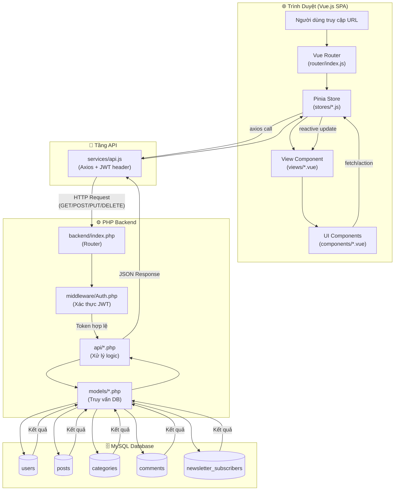
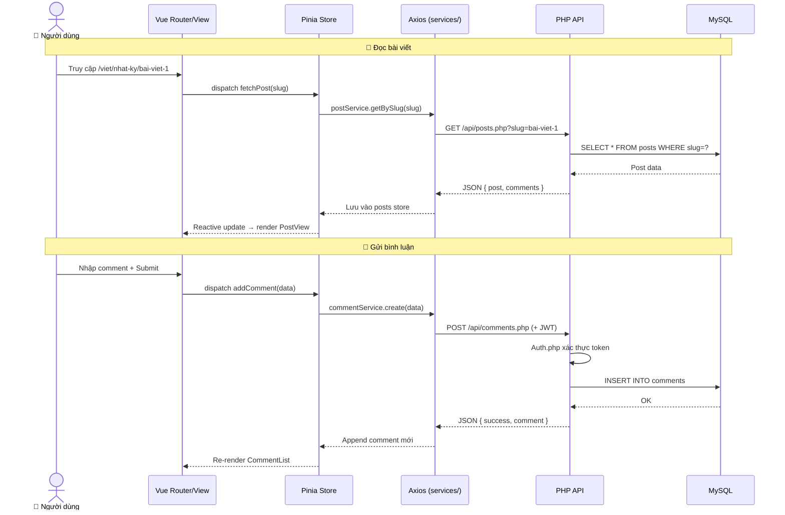
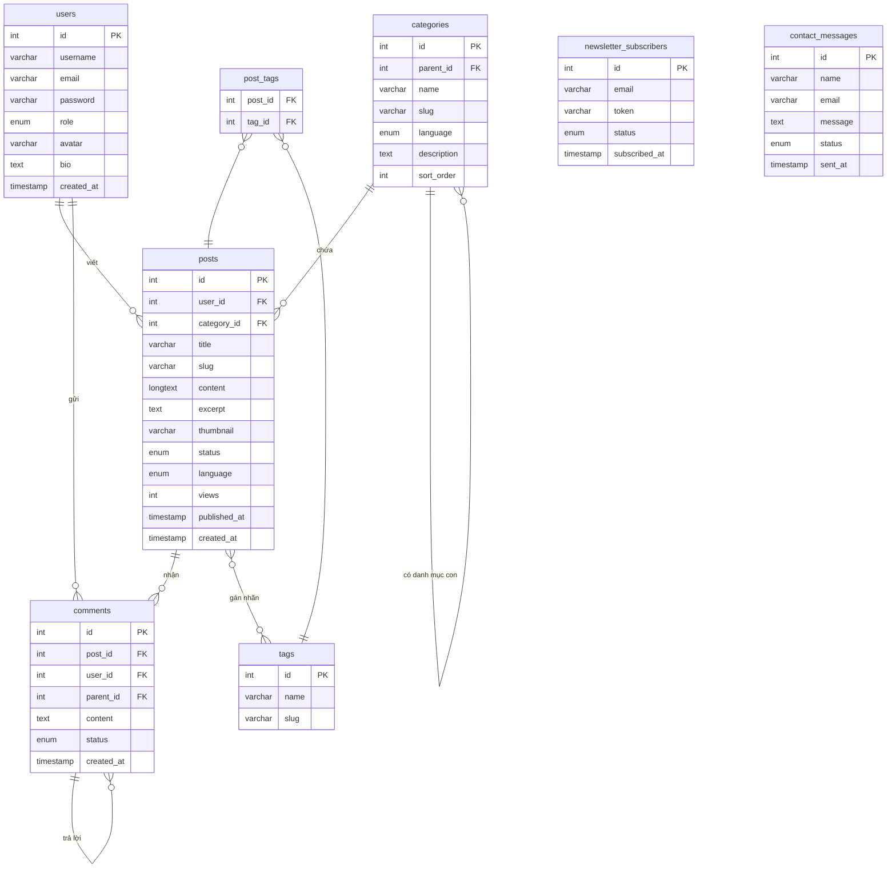

# 🏗️ Kiến Trúc Blog Platform — Vue.js + PHP + JavaScript
> Tham khảo thiết kế: **riolamwritings.com** | Stack: Vue 3 (Vite) · PHP 8 · MySQL · Laragon

---

## 🔍 Phân Tích riolamwritings.com

Từ trang tham khảo, các tính năng cần có:

| Tính năng | Mô tả |
|---|---|
| **Đa ngôn ngữ** | Viet (Ghi Chép, Nhật Ký, Truyện, Thơ) + Eng (Journal, Diary, Poem) |
| **Translations** | Trang riêng cho bài dịch |
| **Danh mục lồng nhau** | Menu dropdown phân cấp (Viet → Nhật Ký...) |
| **Bài viết excerpt** | Trang chủ hiển thị tóm tắt + "Read More" |
| **Bình luận** | Hiển thị Recent Comments trên sidebar |
| **Newsletter** | Subscribe nhận bài mới qua email |
| **Recent Articles** | Sidebar liệt kê bài mới nhất |
| **Social Links** | Twitter, Facebook, Instagram, LinkedIn, Email |
| **Phân trang** | Điều hướng theo số trang |
| **About + Copyright + Contact** | Các trang tĩnh |
| **Slug URL đẹp** | `/2020/03/17/ten-bai-viet/` |

---

## 📁 Cây Thư Mục Toàn Bộ

```
blog/                                  ← Thư mục gốc (laragon/www/Blog/blog/)
│
├── 📁 frontend/                       ← Vue.js App (Vite)
│   ├── index.html                     ← Entry point HTML của Vite
│   ├── vite.config.js                 ← Cấu hình Vite + proxy API
│   ├── package.json                   ← Dependencies (vue-router, pinia, axios...)
│   │
│   └── 📁 src/
│       ├── main.js                    ← Khởi tạo Vue app, plugins
│       ├── App.vue                    ← Root component, layout shell
│       │
│       ├── 📁 router/
│       │   └── index.js               ← Vue Router: định nghĩa tất cả routes
│       │
│       ├── 📁 stores/                 ← Pinia state management
│       │   ├── auth.js                ← State: user, token, isLoggedIn
│       │   ├── posts.js               ← State: danh sách bài, bài hiện tại
│       │   └── ui.js                  ← State: dark mode, language, loading
│       │
│       ├── 📁 services/               ← Gọi API PHP (axios wrappers)
│       │   ├── api.js                 ← Axios instance + interceptors
│       │   ├── postService.js         ← CRUD bài viết
│       │   ├── commentService.js      ← CRUD bình luận
│       │   ├── authService.js         ← Login, register, logout
│       │   └── newsletterService.js   ← Subscribe email
│       │
│       ├── 📁 components/             ← UI Components tái sử dụng
│       │   ├── layout/
│       │   │   ├── AppHeader.vue      ← Navbar + menu dropdown đa cấp
│       │   │   ├── AppFooter.vue      ← Footer + social links
│       │   │   └── AppSidebar.vue     ← Sidebar: recent posts, comments, newsletter
│       │   │
│       │   ├── post/
│       │   │   ├── PostCard.vue       ← Card bài viết (ảnh, tiêu đề, excerpt)
│       │   │   ├── PostList.vue       ← Danh sách PostCard + phân trang
│       │   │   ├── PostContent.vue    ← Nội dung chi tiết bài viết
│       │   │   └── PostMeta.vue       ← Ngày, tác giả, danh mục, tags
│       │   │
│       │   ├── comment/
│       │   │   ├── CommentList.vue    ← Danh sách bình luận
│       │   │   ├── CommentItem.vue    ← Một bình luận
│       │   │   └── CommentForm.vue    ← Form gửi bình luận
│       │   │
│       │   ├── common/
│       │   │   ├── Pagination.vue     ← Điều hướng trang (prev/next/số)
│       │   │   ├── SearchBar.vue      ← Ô tìm kiếm live
│       │   │   ├── LanguageSwitcher.vue ← Chuyển Viet/Eng
│       │   │   ├── SocialShare.vue    ← Chia sẻ bài viết
│       │   │   └── NewsletterBox.vue  ← Form đăng ký email
│       │   │
│       │   └── admin/
│       │       ├── AdminSidebar.vue   ← Menu điều hướng admin
│       │       ├── PostEditor.vue     ← Trình soạn thảo bài (rich text)
│       │       └── DataTable.vue      ← Bảng dữ liệu có sắp xếp/lọc
│       │
│       ├── 📁 views/                  ← Các trang (page-level components)
│       │   ├── HomeView.vue           ← Trang chủ: bài viết mới nhất
│       │   ├── PostView.vue           ← Chi tiết một bài viết + comments
│       │   ├── CategoryView.vue       ← Bài viết theo danh mục
│       │   ├── TranslationsView.vue   ← Trang bài dịch
│       │   ├── SearchView.vue         ← Kết quả tìm kiếm
│       │   ├── AboutView.vue          ← Giới thiệu tác giả
│       │   ├── ContactView.vue        ← Form liên hệ
│       │   ├── CopyrightsView.vue     ← Trang bản quyền
│       │   ├── auth/
│       │   │   ├── LoginView.vue      ← Đăng nhập
│       │   │   └── RegisterView.vue   ← Đăng ký
│       │   └── admin/
│       │       ├── DashboardView.vue  ← Tổng quan admin
│       │       ├── PostsManage.vue    ← Quản lý bài viết
│       │       ├── PostCreate.vue     ← Tạo bài mới
│       │       ├── PostEdit.vue       ← Sửa bài viết
│       │       ├── CategoriesManage.vue ← Quản lý danh mục
│       │       ├── CommentsManage.vue ← Duyệt bình luận
│       │       └── SettingsView.vue   ← Cài đặt website
│       │
│       └── 📁 assets/
│           ├── 📁 css/
│           │   ├── main.css           ← Reset, biến CSS (màu, font, spacing)
│           │   └── transitions.css    ← Hiệu ứng chuyển trang Vue
│           └── 📁 images/
│               ├── logo.svg           ← Logo blog
│               └── default-avatar.png ← Avatar mặc định
│
├── 📁 backend/                        ← PHP API Server
│   ├── 📁 config/
│   │   ├── database.php               ← Kết nối PDO MySQL
│   │   └── config.php                 ← Hằng số, CORS headers, session
│   │
│   ├── 📁 middleware/
│   │   ├── Auth.php                   ← Kiểm tra JWT token
│   │   └── AdminOnly.php             ← Chặn không phải admin
│   │
│   ├── 📁 models/                     ← Tầng truy xuất database
│   │   ├── Post.php                   ← CRUD bài viết
│   │   ├── Category.php               ← CRUD danh mục
│   │   ├── Comment.php                ← CRUD bình luận
│   │   ├── User.php                   ← CRUD người dùng
│   │   └── Newsletter.php             ← Quản lý subscriber
│   │
│   ├── 📁 api/                        ← Endpoints trả JSON
│   │   ├── posts.php                  ← GET/POST/PUT/DELETE bài viết
│   │   ├── categories.php             ← GET/POST/PUT/DELETE danh mục
│   │   ├── comments.php               ← GET/POST/DELETE bình luận
│   │   ├── auth.php                   ← POST login/register/logout
│   │   ├── search.php                 ← GET tìm kiếm full-text
│   │   ├── newsletter.php             ← POST đăng ký email
│   │   ├── upload.php                 ← POST upload ảnh
│   │   └── contact.php                ← POST gửi form liên hệ
│   │
│   ├── 📁 uploads/                    ← File ảnh người dùng upload
│   │   ├── thumbnails/                ← Ảnh bài viết
│   │   └── avatars/                   ← Ảnh đại diện
│   │
│   └── index.php                      ← Router PHP: phân loại request → api/*
│
├── 📁 database/
│   ├── blog.sql                       ← Script tạo toàn bộ bảng + dữ liệu mẫu
│   └── migrations/                    ← Lịch sử thay đổi schema theo phiên bản
│
├── .htaccess                          ← Rewrite: /api/* → backend/, còn lại → frontend/
└── README.md                          ← Hướng dẫn cài đặt
```

---

## 🔄 Luồng Hoạt Động (Activity Flow)



---

## 🔄 Luồng Chi Tiết Từng Tính Năng



---

## 🗄️ Thiết Kế Database

### Sơ Đồ ERD



### SQL Chi Tiết

```sql
-- =============================================
-- BẢNG NGƯỜI DÙNG
-- =============================================
CREATE TABLE users (
    id          INT AUTO_INCREMENT PRIMARY KEY,
    username    VARCHAR(50)  UNIQUE NOT NULL,
    email       VARCHAR(100) UNIQUE NOT NULL,
    password    VARCHAR(255) NOT NULL,          -- bcrypt hash
    role        ENUM('reader','author','admin') DEFAULT 'reader',
    avatar      VARCHAR(255),
    bio         TEXT,
    created_at  TIMESTAMP DEFAULT CURRENT_TIMESTAMP
);

-- =============================================
-- BẢNG DANH MỤC (hỗ trợ lồng nhau + đa ngôn ngữ)
-- =============================================
CREATE TABLE categories (
    id          INT AUTO_INCREMENT PRIMARY KEY,
    parent_id   INT DEFAULT NULL,              -- NULL = danh mục gốc (Viet/Eng)
    name        VARCHAR(100) NOT NULL,
    slug        VARCHAR(100) UNIQUE NOT NULL,
    language    ENUM('vi','en','all') DEFAULT 'all',
    description TEXT,
    sort_order  INT DEFAULT 0,
    FOREIGN KEY (parent_id) REFERENCES categories(id) ON DELETE SET NULL
);

-- Dữ liệu mẫu giống riolamwritings.com
INSERT INTO categories (parent_id, name, slug, language, sort_order) VALUES
(NULL, 'Viet', 'viet', 'vi', 1),
(NULL, 'Eng', 'eng', 'en', 2),
(NULL, 'Translations', 'translations', 'all', 3),
(1, 'Ghi Chép', 'viet/ghi-chep', 'vi', 1),
(1, 'Nhật Ký', 'viet/nhat-ky', 'vi', 2),
(1, 'Truyện', 'viet/truyen', 'vi', 3),
(1, 'Thơ', 'viet/tho', 'vi', 4),
(2, 'Journal', 'eng/journal', 'en', 1),
(2, 'Diary', 'eng/diary', 'en', 2),
(2, 'Poem', 'eng/poem', 'en', 3);

-- =============================================
-- BẢNG BÀI VIẾT
-- =============================================
CREATE TABLE posts (
    id           INT AUTO_INCREMENT PRIMARY KEY,
    user_id      INT NOT NULL,
    category_id  INT,
    title        VARCHAR(255) NOT NULL,
    slug         VARCHAR(255) UNIQUE NOT NULL,  -- vd: 2020/03/17/ten-bai-viet
    content      LONGTEXT NOT NULL,
    excerpt      TEXT,                          -- Tóm tắt hiển thị trang chủ
    thumbnail    VARCHAR(255),
    status       ENUM('draft','published') DEFAULT 'draft',
    language     ENUM('vi','en') DEFAULT 'vi',
    views        INT DEFAULT 0,
    published_at TIMESTAMP NULL,
    created_at   TIMESTAMP DEFAULT CURRENT_TIMESTAMP,
    updated_at   TIMESTAMP DEFAULT CURRENT_TIMESTAMP ON UPDATE CURRENT_TIMESTAMP,
    FOREIGN KEY (user_id)     REFERENCES users(id),
    FOREIGN KEY (category_id) REFERENCES categories(id) ON DELETE SET NULL,
    FULLTEXT KEY ft_search (title, content)    -- Tìm kiếm full-text
);

-- =============================================
-- BẢNG TAGS
-- =============================================
CREATE TABLE tags (
    id   INT AUTO_INCREMENT PRIMARY KEY,
    name VARCHAR(50) UNIQUE NOT NULL,
    slug VARCHAR(50) UNIQUE NOT NULL
);

CREATE TABLE post_tags (
    post_id INT NOT NULL,
    tag_id  INT NOT NULL,
    PRIMARY KEY (post_id, tag_id),
    FOREIGN KEY (post_id) REFERENCES posts(id) ON DELETE CASCADE,
    FOREIGN KEY (tag_id)  REFERENCES tags(id)  ON DELETE CASCADE
);

-- =============================================
-- BẢNG BÌNH LUẬN (hỗ trợ reply lồng nhau)
-- =============================================
CREATE TABLE comments (
    id         INT AUTO_INCREMENT PRIMARY KEY,
    post_id    INT NOT NULL,
    user_id    INT NOT NULL,
    parent_id  INT DEFAULT NULL,              -- NULL = comment gốc, có giá trị = reply
    content    TEXT NOT NULL,
    status     ENUM('pending','approved','spam') DEFAULT 'pending',
    created_at TIMESTAMP DEFAULT CURRENT_TIMESTAMP,
    FOREIGN KEY (post_id)   REFERENCES posts(id)    ON DELETE CASCADE,
    FOREIGN KEY (user_id)   REFERENCES users(id),
    FOREIGN KEY (parent_id) REFERENCES comments(id) ON DELETE CASCADE
);

-- =============================================
-- BẢNG NEWSLETTER SUBSCRIBERS
-- =============================================
CREATE TABLE newsletter_subscribers (
    id            INT AUTO_INCREMENT PRIMARY KEY,
    email         VARCHAR(100) UNIQUE NOT NULL,
    token         VARCHAR(64),                -- Token xác nhận email
    status        ENUM('pending','active','unsubscribed') DEFAULT 'pending',
    subscribed_at TIMESTAMP DEFAULT CURRENT_TIMESTAMP
);

-- =============================================
-- BẢNG LIÊN HỆ
-- =============================================
CREATE TABLE contact_messages (
    id      INT AUTO_INCREMENT PRIMARY KEY,
    name    VARCHAR(100) NOT NULL,
    email   VARCHAR(100) NOT NULL,
    message TEXT NOT NULL,
    status  ENUM('unread','read','replied') DEFAULT 'unread',
    sent_at TIMESTAMP DEFAULT CURRENT_TIMESTAMP
);
```

---

## 📌 Vai Trò Từng Thư Mục — Bảng Tóm Tắt

### Frontend (Vue.js)

| Thư mục/File | Vai trò |
|---|---|
| `src/router/index.js` | Định nghĩa tất cả route URL của SPA, lazy-load views |
| `src/stores/*.js` | Pinia: quản lý state toàn cục (bài viết, user, UI) |
| `src/services/*.js` | Wrapper Axios: gọi API PHP, xử lý token JWT |
| `src/views/*.vue` | Page-level component — mỗi view là một trang |
| `src/components/layout/` | Header, Footer, Sidebar — dùng trên mọi trang |
| `src/components/post/` | Card, List, Content — hiển thị bài viết |
| `src/components/comment/` | Form, List, Item — hệ thống bình luận |
| `src/components/common/` | Pagination, Search, Newsletter — tiện ích chung |
| `src/components/admin/` | Editor, DataTable — riêng cho trang quản trị |

### Backend (PHP)

| Thư mục/File | Vai trò |
|---|---|
| `backend/config/` | Kết nối DB, CORS headers, constants |
| `backend/middleware/` | Xác thực JWT, kiểm tra quyền admin |
| `backend/models/` | Tầng Model: mọi câu SQL đều viết ở đây |
| `backend/api/` | Endpoint: nhận request → gọi model → trả JSON |

---

## 🔗 Ánh Xạ Tính Năng → Vue Route → PHP API

| Tính năng | Vue Route | PHP API |
|---|---|---|
| Trang chủ | `/` → `HomeView.vue` | `GET /api/posts.php?latest=true` |
| Danh mục Viet | `/viet` → `CategoryView.vue` | `GET /api/posts.php?lang=vi` |
| Nhật ký | `/viet/nhat-ky` → `CategoryView.vue` | `GET /api/posts.php?category=nhat-ky` |
| Chi tiết bài | `/2020/03/17/slug` → `PostView.vue` | `GET /api/posts.php?slug=...` |
| Translations | `/translations` → `TranslationsView.vue` | `GET /api/posts.php?category=translations` |
| Tìm kiếm | `/search?q=...` → `SearchView.vue` | `GET /api/search.php?q=...` |
| Đăng nhập | `/login` → `LoginView.vue` | `POST /api/auth.php?action=login` |
| Admin | `/admin` → `DashboardView.vue` | (protected routes) |
| Newsletter | (component) `NewsletterBox.vue` | `POST /api/newsletter.php` |

---

> [!IMPORTANT]
> **Vite Proxy config** — Để tránh CORS khi dev, cấu hình `vite.config.js`:
> ```js
> server: {
>   proxy: {
>     '/api': 'http://localhost/Blog/blog/backend'
>   }
> }
> ```

> [!TIP]
> **Thứ tự xây dựng gợi ý:**
> 1. Tạo database + chạy `blog.sql`
> 2. Xây dựng PHP backend (config → models → api)
> 3. Xây dựng Vue frontend (router → stores → services → views → components)
> 4. Kết nối Axios → API, kiểm tra từng endpoint
