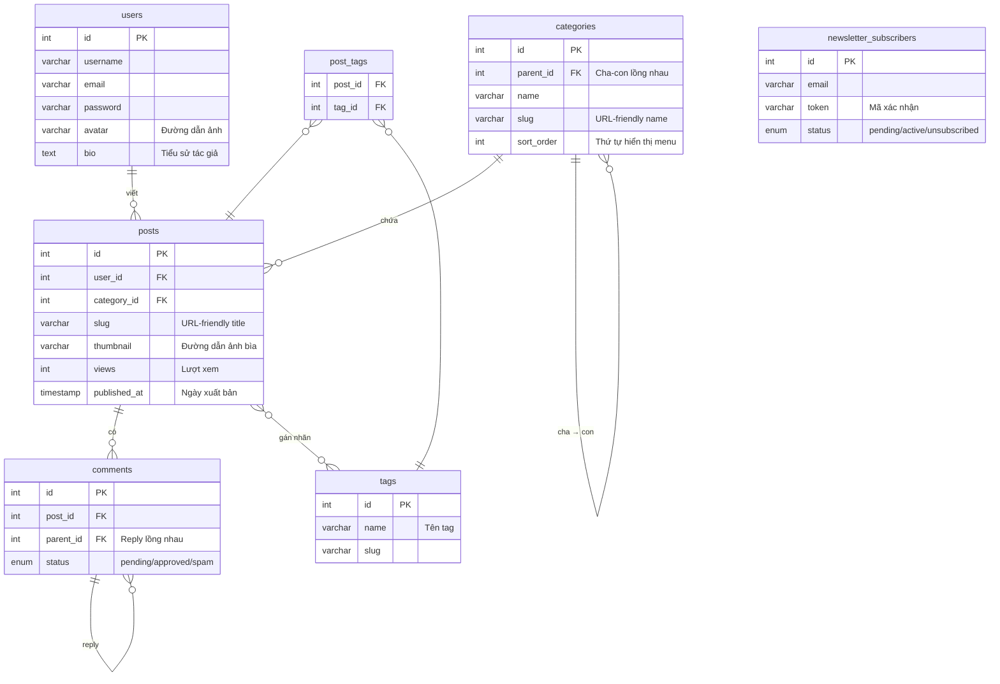

# 🗄️ Giải Thích Chi Tiết Database — Phần 1

1️⃣ avatar VARCHAR(255) trong bảng users — Không lưu ảnh, lưu đường dẫn
Database không bao giờ lưu file ảnh thật. Ảnh được lưu vào thư mục uploads/avatars/ trên ổ đĩa, còn database chỉ lưu chuỗi đường dẫn như "uploads/avatars/user_1.jpg". Khi Vue cần hiển thị thì ghép chuỗi đó vào . Lý do: lưu ảnh vào DB sẽ làm DB cực kỳ nặng và chậm.

2️⃣ bio TEXT trong bảng profiles — Tiểu sử tác giả
Bio = Biography — đoạn text tác giả tự viết giới thiệu bản thân, hiển thị trên trang hồ sơ/About. Dùng TEXT thay vì VARCHAR vì bio có thể dài hơn 255 ký tự.

3️⃣ parent_id trong bảng categories và comments — Quan hệ cha–con trong cùng một bảng
Xuất hiện ở 2 chỗ với 2 mục đích:

Bảng categories: Tạo menu phân cấp (nếu có). Danh mục gốc có parent_id = NULL, danh mục con trỏ vào id của cha.
Bảng comments: Tạo hệ thống reply bình luận lồng nhau. Comment gốc có parent_id = NULL, reply thì parent_id = id của comment được reply.


# 🗄️ Giải Thích Chi Tiết Database — Phần 2

---

## 📂 Bảng `categories` — Các thuộc tính khó hiểu

### `sort_order INT DEFAULT 0`

**Ý nghĩa:** Số thứ tự sắp xếp hiển thị menu. Danh mục nào có `sort_order` nhỏ hơn thì hiển thị trước.

**Ví dụ thực tế:**

```
id | name      | sort_order   →   Menu hiển thị:
---+-----------+------------       1. Ghi Chép
 1 | Ghi Chép  |     1             2. Nhật Ký
 2 | Nhật Ký   |     2             3. Truyện
 3 | Truyện    |     3             4. Thơ
 4 | Thơ       |     4
```

Nếu bạn muốn đưa "Thơ" lên trước, chỉ cần đổi `sort_order`:
```sql
UPDATE categories SET sort_order = 1 WHERE name = 'Thơ';
UPDATE categories SET sort_order = 2 WHERE name = 'Ghi Chép';
```

> [!TIP]
> Nếu không có `sort_order`, database sẽ trả về theo thứ tự chèn vào — bạn không kiểm soát được thứ tự menu.

---

### `slug VARCHAR(100)` trong `categories`

**Ý nghĩa:** Phiên bản "URL-friendly" của tên danh mục — dùng làm đường dẫn truy cập.

**Vấn đề:** Tên danh mục như *"Nhật Ký"* **không thể** đưa thẳng vào URL vì có dấu tiếng Việt và khoảng trắng.

**Giải pháp — dùng slug:**

```
Tên hiển thị  →  Slug (URL-safe)
Ghi Chép      →  ghi-chep
Nhật Ký       →  nhat-ky
Truyện        →  truyen
Thơ           →  tho
```

**Kết quả URL:**
```
❌ Không dùng slug:  /category/Nhật Ký          ← Lỗi trên trình duyệt
✅ Dùng slug:        /category/nhat-ky           ← Hoạt động tốt
```

**Ví dụ trong bảng:**
```
id | name      | slug
---+-----------+-------------
 1 | Ghi Chép  | ghi-chep
 2 | Nhật Ký   | nhat-ky
 3 | Truyện    | truyen
 4 | Thơ       | tho
```

Vue Router dùng slug để điều hướng:
```js
// router/index.js
{ path: '/category/:slug', component: CategoryView }
// → /category/nhat-ky
```

---

## 📝 Bảng `posts` — Các thuộc tính khó hiểu

### `slug VARCHAR(255)` trong `posts`

**Ý nghĩa:** Tương tự slug danh mục, nhưng dùng làm địa chỉ URL cho từng bài viết cụ thể.

**Ví dụ (theo phong cách riolamwritings.com):**
```
Tiêu đề: "Đừng bước điềm nhiên vào giấc ngủ sâu"
Slug:     2016/02/10/dung-buoc-diem-nhien-vao-giac-ngu-sau

→ URL:  /post/2016/02/10/dung-buoc-diem-nhien-vao-giac-ngu-sau
```

**Tại sao cần slug thay vì dùng ID?**

| Dùng ID (xấu) | Dùng Slug (tốt) |
|---|---|
| `/post?id=42` | `/2016/02/10/dung-buoc-diem-nhien-vao-giac-ngu-sau` |
| Không mô tả nội dung | Rõ ràng, dễ nhớ |
| SEO kém | SEO tốt hơn |
| Dễ đoán → bảo mật kém | Khó đoán |

```
id | title                        | slug
---+------------------------------+--------------------------------------
 1 | Đừng bước điềm nhiên...      | 2016/02/10/dung-buoc-diem-nhien...
 2 | Vì đời đẹp quá...            | 2017/04/18/vi-doi-dep-qua...
```

---

### `thumbnail VARCHAR(255)`

**Ý nghĩa:** Đường dẫn đến **ảnh đại diện của bài viết** — ảnh nhỏ hiển thị ở trang chủ, trang danh mục khi liệt kê bài.

**Tương tự `avatar`** — không lưu file ảnh, chỉ lưu đường dẫn:
```
thumbnail = "uploads/thumbnails/post_42_cover.jpg"
```

**Cách hiển thị:**
```
🏠 Trang chủ — PostCard.vue
┌─────────────────────────────────┐
│  [ 🖼️ thumbnail ảnh bài viết ]  │  ← img :src="post.thumbnail"
│                                 │
│  Tiêu đề bài viết               │
│  Ngày · Danh mục                │
│  Tóm tắt nội dung...            │
│  [Đọc Thêm →]                   │
└─────────────────────────────────┘
```

Nếu `thumbnail = NULL` → Vue dùng ảnh mặc định `default-thumbnail.jpg`.

---

### `views INT DEFAULT 0`

**Ý nghĩa:** Đếm số lần bài viết được đọc (lượt xem).

**Cách hoạt động:**

```
Người dùng mở bài viết
       ↓
PHP nhận request GET /api/posts.php?slug=...
       ↓
PHP tăng views lên 1:
  UPDATE posts SET views = views + 1 WHERE slug = ?
       ↓
Trả bài viết về cho Vue (kèm số views mới)
```

**Hiển thị trên bài viết:**
```
📅 18 Tháng 4, 2017  ·  👁️ 1,234 lượt xem  ·  📂 Nhật Ký
```

---

### `published_at TIMESTAMP NULL`

**Ý nghĩa:** Ngày giờ bài viết được **công bố công khai**. Khác với `created_at` là ngày tạo.

**Tại sao cần 2 trường thời gian?**

```
Tình huống thực tế:
  - Ngày 20/04: Tác giả tạo bài, lưu nháp (status = 'draft')
                → created_at = '2026-04-20 09:00:00'
                → published_at = NULL

  - Ngày 27/04: Tác giả bấm "Xuất bản"
                → status = 'published'
                → published_at = '2026-04-27 14:30:00'  ← Ghi lại lúc này
```

**Dùng để làm gì?**
- Hiển thị "27 Tháng 4, 2026" trên bài — lấy từ `published_at`, không phải `created_at`
- **Lên lịch đăng bài:** Set `published_at` vào tương lai → PHP chỉ trả bài khi `NOW() >= published_at`
- Sắp xếp bài theo ngày xuất bản (không phải ngày tạo)

---

## 🏷️ Bảng `tags` — Gán nhãn bài viết

**Ý nghĩa:** Lưu danh sách các **nhãn (tag)** dùng để gán cho bài viết.

**Ví dụ:**
```
id | name        | slug
---+-------------+------------
 1 | Dylan Thomas| dylan-thomas
 2 | Thơ dịch    | tho-dich
 3 | 2020        | 2020
 4 | Yêu nước    | yeu-nuoc
```

Tags giúp nhóm bài viết theo chủ đề **xuyên danh mục**:
- Tìm tất cả bài có tag "Dylan Thomas" → ra các bài dù thuộc danh mục nào
- Tìm tất cả bài tag "2020" → ra các bài viết trong năm 2020

---

## 🔗 Bảng `post_tags` — Quan hệ Nhiều–Nhiều

**Vấn đề cần giải quyết:** Một bài viết có **nhiều tag**, và một tag thuộc **nhiều bài viết**. Đây là quan hệ **Nhiều–Nhiều (Many-to-Many)**.

**Không thể** lưu thế này vì vi phạm chuẩn database:
```
❌ Sai: posts.tags = "dylan-thomas, tho-dich, 2020"  ← Không query được
```

**Giải pháp:** Tạo bảng trung gian `post_tags`:

```
posts           post_tags          tags
─────────       ────────────       ────────────
id=1 (bài A) ──→ post_id=1, tag_id=1 ──→ id=1 (Dylan Thomas)
             ──→ post_id=1, tag_id=2 ──→ id=2 (Thơ dịch)
id=2 (bài B) ──→ post_id=2, tag_id=1 ──→ id=1 (Dylan Thomas) ← Tag dùng lại
             ──→ post_id=2, tag_id=4 ──→ id=4 (Yêu nước)
```

**Kết quả:**
```
Bài A có tags: Dylan Thomas, Thơ dịch
Bài B có tags: Dylan Thomas, Yêu nước
Tag "Dylan Thomas" thuộc: Bài A, Bài B
```

**Query lấy tất cả tag của bài viết:**
```sql
SELECT tags.name
FROM tags
JOIN post_tags ON tags.id = post_tags.tag_id
WHERE post_tags.post_id = 1;
```

---

## 💬 Bảng `comments` — Reply lồng nhau

**`parent_id`** là thuộc tính then chốt để tạo luồng bình luận có thể reply.

```
💬 id=1, parent=NULL  → "Bài này hay quá!"           (gốc)
   └── 💬 id=2, parent=1 → "Cảm ơn bạn nhé!"        (reply id=1)
       └── 💬 id=3, parent=2 → "Mình thích chỗ..."   (reply id=2)
💬 id=4, parent=NULL  → "Đọc xong thấy hay lắm"      (gốc khác)
```

**Trong database:**
```
id | post_id | parent_id | content
---+---------+-----------+------------------------
 1 |    5    |   NULL    | "Bài này hay quá!"
 2 |    5    |     1     | "Cảm ơn bạn nhé!"
 3 |    5    |     2     | "Mình thích chỗ..."
 4 |    5    |   NULL    | "Đọc xong thấy hay lắm"
```

**Thuộc tính `status ENUM('pending','approved','spam')`:**
- `pending` → Bình luận mới, chờ admin duyệt (chưa hiển thị công khai)
- `approved` → Đã duyệt, hiển thị bình thường
- `spam` → Bị đánh dấu spam, ẩn đi

---

## 📧 Bảng `newsletter_subscribers` — Đăng ký nhận bài mới

**Ý nghĩa:** Lưu danh sách email của người đăng ký nhận thông báo khi có bài mới (giống widget *"Be The First"* trên riolamwritings.com có **6,266 subscribers**).

```
Sidebar riolamwritings.com:
┌─────────────────────────┐
│  📬 Be The First        │
│  to receive updates     │
│  Join 6,266 subscribers │
│  [Email Address    ]    │
│  [   Sign Me Up    ]    │
└─────────────────────────┘
```

**Giải thích từng cột:**

| Cột | Giải thích |
|---|---|
| `email` | Địa chỉ email người đăng ký |
| `token` | Mã xác nhận gửi vào email (để chống spam) |
| `status: pending` | Vừa đăng ký, chưa xác nhận qua email |
| `status: active` | Đã click link xác nhận → nhận bài mới |
| `status: unsubscribed` | Đã hủy đăng ký |

**Luồng hoạt động:**
```
1. User nhập email → POST /api/newsletter.php
2. PHP lưu vào DB với status='pending', tạo token ngẫu nhiên
3. PHP gửi email xác nhận: "Click đây để xác nhận"
4. User click link: /api/newsletter.php?confirm=<token>
5. PHP đổi status = 'active'
6. Khi có bài mới → PHP gửi email đến tất cả status='active'
```

---

## 📊 Sơ Đồ Toàn Bộ Các Bảng & Quan Hệ

